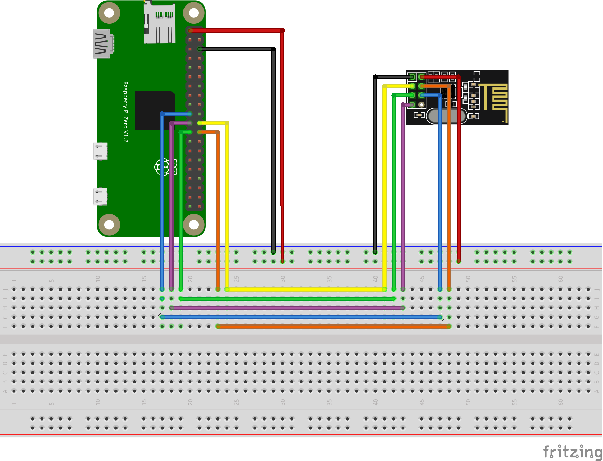
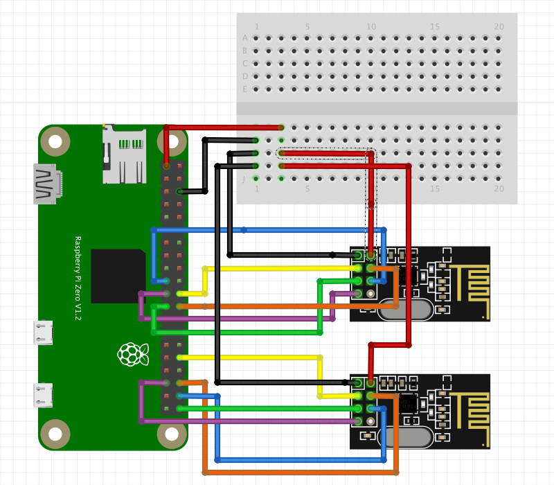

# nrf24 for Python

This package implement 2.4Ghz communication using NRF24L01+ modules on a Raspberry Pi using Python.

The code is based on a modified version of some example code found on [StackExchange](https://raspberrypi.stackexchange.com/questions/77290/nrf24l01-only-correctly-retrieving-status-and-config-registers).  The author of the original code is also the author of the ```pigpio``` library found here http://abyz.me.uk/rpi/pigpio/.

I have obtained the original authors approval to modify and distribute the code anyway I want.  So, I have created a very basic Python package and published it on PyPI under a MIT license.

The ```nrf24``` packages depends on the ```pigpio``` package that is available via PyPI as well.  Before installing and running any of the code and examples below, please make sure you the ```pigpid``` daemon running on your Raspberry.  This is a library/server that provides access to the GPIO ports of the Raspberry.

Details avalable at http://abyz.me.uk/rpi/pigpio/download.html

Quick installation on Raspbian:

    sudo apt-get update    
    sudo apt-get install pigpio python-pigpio python3-pigpio


## Installing

You may want to create a virtual environment before installing the `nrf24` package which depends on the `pigpio` package. 

    $ pip install nrf24


## Examples

All examples in the `test` folder can be run as command line programs.  They all take optional command line arguments
to specify the `hostname` (default: `localhost`) and the `port` (default: `8888`) of the `pigpio` deamon.  Most of them
also takes one or more addresses to use.  All should have sensible defaults, so running them without arguments should
be an OK first approach to testing your setup.

All test have been run on a Raspberry Pi 4 and a Raspberry Pi Zero Wireless equipped with 2 x NRF24L01+ modules each.

All examples run with a wiring like the one shown in the Fritzing diagram "Raspberry Pi with Single NRF24L01+ Module"
below, except the `multi-sender.py` and `multi-receiver.py` examples which requires two NRF24L01+ modules connected to 
the Raspberry Pi as shown in "Raspberry Pi with Dual NRF24L01+ Modules" below.


| Command Line                 | Comments |
| ---------------------------- | -------- |
| <span style="white-space: nowrap;">`python test/simple-sender.py`</span> | Emulates a process sending sensor readings every 10 seconds using a **dynamic** payload size (default sending address is `1SNSR`). |
| <span style="white-space: nowrap;">`python test/simple-receiver.py`</span> | Emulates a receiving process receiving sensor readings from the corresponding sender using a **dynamic** payload size (default listening address `1SNSR`). |
| <span style="white-space: nowrap;">`python test/fixed-sender.py`</span> | Emulates a process sending sensor readings every 10 seconds using a **fixed** payload size (default sending address is `1SNSR`). |
| <span style="white-space: nowrap;">`python test/fixed-receiver.py`</span> | Emulates a receiving process receiving sensor readings from the corresponding sender using a **fixed** payload size (default listening address `1SNSR`). |
| <span style="white-space: nowrap;">`python test/mixed-sender.py`</span>| Shows an example of sending both **fixed** and **dynamic** payload sized messages. Suggested address for fixed messages is `FTEST`, and the suggested address for dynamic messages is `DTEST`. |
| <span style="white-space: nowrap;">`python test/mixed-receiver.py` </span> | Shows how to configure reading pipes using both **fixed** and **dynamic** message sizes at the same time. |
| <span style="white-space: nowrap;">`python test/int-sender.py`</span> | Shows how to use interrupt to detect that a message has been sent (default sending address `1SNSR`). |
| <span style="white-space: nowrap;">`python test/int-receiver.py`</span> | Shows how to use interrupt to detect that a message has been received (default listening address `1SNSR`). |
| <span style="white-space: nowrap;">`python test/rr-client.py`</span> | Shows example of how to send a request to a server with a reply to address included in the message, and then switching to RX mode to receive the response from the server (default server (TX) address is `1SRVR` and default reply to address (RX) is `1CLNT`) |
| <span style="white-space: nowrap;">`python test/rr-server.py`</span> | Shows example of a server listening for requests and returning a response to the client (default server (RX) address is `1SRVR`). |
| <span style="white-space: nowrap;">`python test/ack-sender.py`</span> | Sends message to the receiver every 10 seconds, expecting a payload sent back with the acknowledgement (default sender address `1ACKS`). |
| <span style="white-space: nowrap;">`python test/ack-receiver.py`</span> | Receives message and sends acknowledgement message with payload (default listen address `1ACKS`).|
| <span style="white-space: nowrap;">`python test/multi-sender.py`</span> | Sends messages using 2 x NRF24L01+ modules connected to the same Raspberry Pi (defult send addresses `1SRVR` and `2SRVR`). |
| <span style="white-space: nowrap;">`python test/multi-sender.py`</span> | receives messages using 2 x NRF24L01+ modules connected to the same Raspberry Pi (defult listen addresses `1SRVR` and `2SRVR`). |

## Wiring

### Raspberry Pi with Single NRF24L01+ Module

All the examples, except the `multi-sender.py` and `multi-receiver.py` ones will run with the following wiring of a single NRF24L01+ module.

<div style="padding: 40px" align="center">

</div>

### Raspberry Pi with Dual NRF24L01+ Modules

The `multi-sender.py` and `multi-receiver.py` examples requires two NRF24L01+ modules wired to each Raspberry Pi.

<div style="padding: 40px" align="center">

</div>


    


